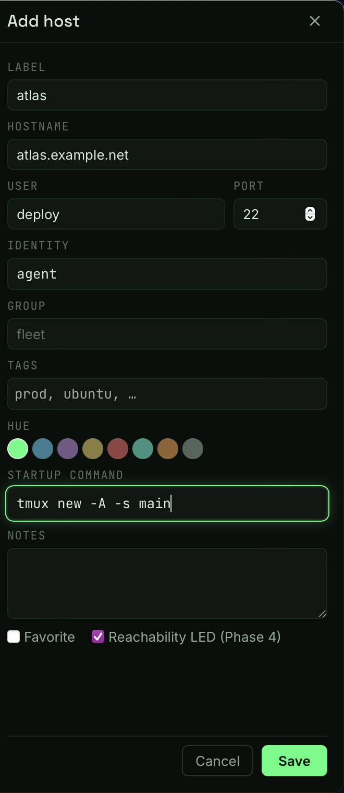

# F1 · Host management & the LED board

Every machine you touch, one keystroke away — and its live status one
glance away. Phase 2 ships the host store and its UI: hosts live in a
plain TOML file you own, your existing `~/.ssh/config` aliases appear
automatically, and the sidebar searches all of it fuzzily. Phase 4 lights
the board: every LED shows, right now, whether its machine answers.



## What is it?

The sidebar is the patch bay: Favorites on top, then your groups, then
ungrouped hosts, then an **ssh config** section listing every concrete
alias from `~/.ssh/config` — and, when Tailscale is installed and
logged in, a **Tailnet** section of live peers
([F9](F09-tailscale.md), Phase 7). Add and edit hosts in a drawer with
inline validation; everything persists to `~/.config/setu/hosts.toml` —
a human-diffable file that's safe to git-sync because it never holds
secrets. A host that is also a tailnet peer (same MagicDNS name) wears
a small `ts` badge instead of appearing twice.

Each row leads with a status LED, lit by the reachability prober: the
moment the app opens, every visible host gets a **bare TCP connect** to
its ssh port — no banner read, no login attempted — and the board lights
within a few seconds. Hosts re-probe every 60 seconds (configurable).

| LED                | Meaning                                             |
| ------------------ | --------------------------------------------------- |
| Hollow ring        | Probing, or probing is off (the tooltip says which) |
| Solid green + glow | Reachable right now — the latency chip fades in     |
| Green, slow pulse  | A live session is open on this host                 |
| Solid red, no glow | Unreachable — hover for when it was last seen up    |

The LED shows **reachability, not auth**: a machine that answers TCP on
its ssh port but would refuse your login still shows green.

## How do I use it?

| Keys    | Action                                         |
| ------- | ---------------------------------------------- |
| ⌘T      | Quick connect (fuzzy search, ⏎ connects)       |
| ⌘K      | Command palette (actions + hosts, F11)         |
| ⌘/      | Toggle the sidebar                             |
| ⌘-click | Select a row for bulk actions                  |
| ⇧-click | Extend the selection over the visible rows     |
| Esc     | Clear the selection (or close a notes popover) |

- **Add a host:** the `+` button beside the search field. Label and
  hostname are required; port must be 1–65535; identity is `agent` (your
  ssh-agent) or a path to a key. A duplicate `user@host:port` warns but
  never blocks.
- **Connect:** click a row (or ⌘T → type → ⏎). Each host row's tooltip
  shows the exact ssh command it will run.
- **Edit / Delete:** hover a row. Delete asks for a second click within
  3 seconds. Deleting a host with live sessions keeps those sessions
  running — their tabs mark "(orphaned)".
- **Copy ssh command** (hover): puts `ssh -p 2222 user@host` (or the bare
  alias) on the clipboard.
- **Groups** collapse and stay collapsed across restarts. The `group`
  field in the editor decides the section.
- **Hue:** each host picks one of 8 identity colors — it underlines the
  host's tabs so you always know where a terminal points.
- **Import from `~/.ssh/config`:** automatic. Every concrete `Host` alias
  (wildcards like `Host *` are skipped) shows in the **ssh config**
  section, read-only, parsed live from the file. Connecting uses the bare
  alias, so ProxyJump, IdentityFile, Match blocks, and Include files all
  behave exactly as they do in your terminal.
- **Adopt** (hover an imported row): copies the alias into `hosts.toml`
  as an editable Setu host. The config file itself is never touched.
- **Bulk actions:** ⌘-click rows (⇧-click for a range), then use the bar
  that appears under the list — set group, add a tag, set hue, or delete
  (second click confirms). Imported rows can't join a selection; adopt
  them first.
- **Notes:** a host with notes gets a note icon on hover; click it for a
  popover rendering a minimal markdown subset — `**bold**`, `*italic*`,
  backtick code, `[links](https://…)`, and `- ` bullets. Links open in
  your system browser.
- **Turn probing off:** per host with `reachability = false` in the
  editor's TOML (or `hosts.toml`); globally with `enabled = false` under
  `[reachability]` in `~/.config/setu/settings.toml`:

  ```toml
  [reachability]
  enabled = true        # global kill switch
  interval_s = 60       # seconds between sweeps
  timeout_ms = 1500     # per-probe connect timeout
  max_concurrent = 6    # probes in flight at once
  ```

Config files: `~/.config/setu/hosts.toml` and `settings.toml` — schema in
[PLAN.md](../../PLAN.md) §4, format details in
[docs/dev/store.md](../dev/store.md). Probing pauses after the app has
been hidden for a minute and sweeps immediately when you come back.

## What can go wrong?

- **`hosts.toml` won't parse.** The sidebar shows the parse error and Setu
  refuses to write to the file until you fix it — a corrupt file is never
  overwritten. Fix the TOML by hand; the error message names the line.
- **Comments in `hosts.toml` disappear.** Setu rewrites the file in
  canonical form on every save. Keep notes in each host's `notes` field
  instead (or in git history if you sync the directory).
- **An adopted host stops jumping through its bastion.** Adoption copies
  hostname/user/port/identity, and Setu then connects with explicit flags
  rather than the alias — ssh options tied to the _alias pattern_ (like
  `ProxyJump` under `Host jump-*`) no longer match. Keep such hosts
  un-adopted; the alias is already a first-class row.
- **Adopt fails with "identity file not found".** The config block names
  an `IdentityFile` that doesn't exist on disk; fix the path in
  `~/.ssh/config` (or create the key) and adopt again.
- **An imported alias vanished from the ssh config section.** A persisted
  host with the same label hides it (that's what Adopt creates). Rename or
  delete the Setu host to see the raw alias again.
- **An imported alias's LED never lights.** Alias-only entries (no
  `HostName` in the config block) are never probed — Setu won't guess what
  the alias resolves to. The tooltip says so; adopt the host (or add a
  `HostName`) to probe it.
- **A host shows green but ssh fails.** The LED is reachability, not
  auth: something answered TCP on that port. Check the user, key, and the
  server's `sshd` logs.
- **The board looks like a port scan to a strict network.** Probes are
  bare connects — no banners, no auth — staggered, capped at
  `max_concurrent`, and re-run only once per `interval_s`. If a network
  still objects, flip the per-host or global kill switch; see the security
  model in [SECURITY.md](../../SECURITY.md).
- **Latency looks high on the first probe.** DNS resolution happens
  inside the probe window, so a cold name adds its lookup time; the next
  sweep reports steady-state latency.
