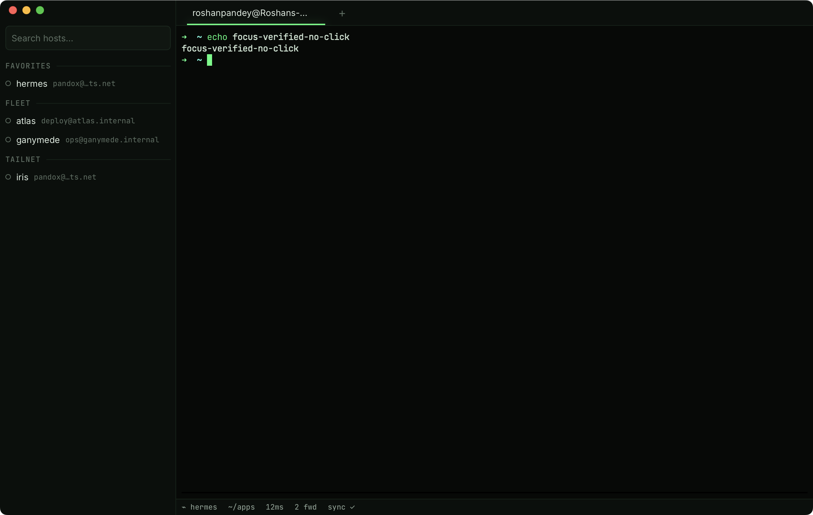

# F2 · Terminal core

Local shell tabs — a real terminal first, an SSH client later. Phase 1
ships the foundation: `$SHELL` in a login session inside a native PTY,
rendered by xterm.js with the Phosphor theme.

## What is it?

Press ⌘N and you get your shell — the same login shell, profile, and locale
behavior as Terminal.app, in a Phosphor-themed tab. Full-screen apps
(`htop`, `vim`, `tmux`) work, resizes propagate instantly, huge outputs
stream without freezing the UI, and closing a tab always terminates the
shell process — no orphans.

## How do I use it?

| Keys         | Action                                                    |
| ------------ | --------------------------------------------------------- |
| ⌘N           | New local shell tab                                       |
| ⌘W           | Close the focused pane (a tab's last pane closes the tab) |
| ⌘1–9         | Go to tab 1–9                                             |
| ⌃Tab / ⌃⇧Tab | Cycle tabs forward / backward                             |
| ⇧⌘F          | Find in terminal (Enter next, ⇧Enter previous, Esc close) |
| ⌘C / ⌘V      | Copy selection / paste                                    |
| ⌘-click      | Open a URL from the terminal in your browser              |

- The `+` button in the tab bar is ⌘N with a mouse; the `×` on each tab
  closes the whole tab — every pane in it, since tabs can split
  ([F04](F04-splits-broadcast.md)).
- More tabs than fit? The strip scrolls — trackpad swipe or mouse wheel —
  and the active tab always scrolls itself into view.
- ⇧⌘F with the bar already open refocuses it and selects the query, so a
  second press never closes your search; Esc or ✕ closes.
- Tab titles follow your shell's title escapes (e.g. `vim` shows itself).
- A pane whose command exits cleanly closes itself (the layout heals; a
  tab's last pane takes the tab with it). A non-zero exit keeps the pane
  (dimmed, with an `exited (code N)` notice) so you can read the output;
  ⌘W closes it.
- Scrollback keeps 10 000 lines per pane.

No config keys yet — profile settings (fonts, cursor styles, ligatures)
arrive with the settings surface in a later phase.

## What can go wrong?

- **Your shell prints an error about `-l`.** Setu starts `$SHELL` with the
  login flag; the standard shells (zsh, bash, fish, sh, dash) all accept
  it. An exotic `$SHELL` that doesn't will show its own error in the tab —
  the tab stays open so you can read it.
- **Unicode looks like boxes.** Widths are handled (Unicode 11), but glyphs
  come from fonts: JetBrains Mono has no Devanagari, for example, so those
  scripts render through system font fallback — correct widths, different
  face.
- **Rendering feels slow on unusual GPUs.** The renderer tries WebGL and
  falls back to DOM rendering automatically (macOS WebViews often lack
  WebGL2). Everything still works; a slower fallback is a known trade-off
  until the Phase 4 polish pass.
- **A tab won't open.** If `$SHELL` points at a missing binary, spawning
  fails. Fix `$SHELL` or unset it — Setu falls back to `/bin/zsh`.
