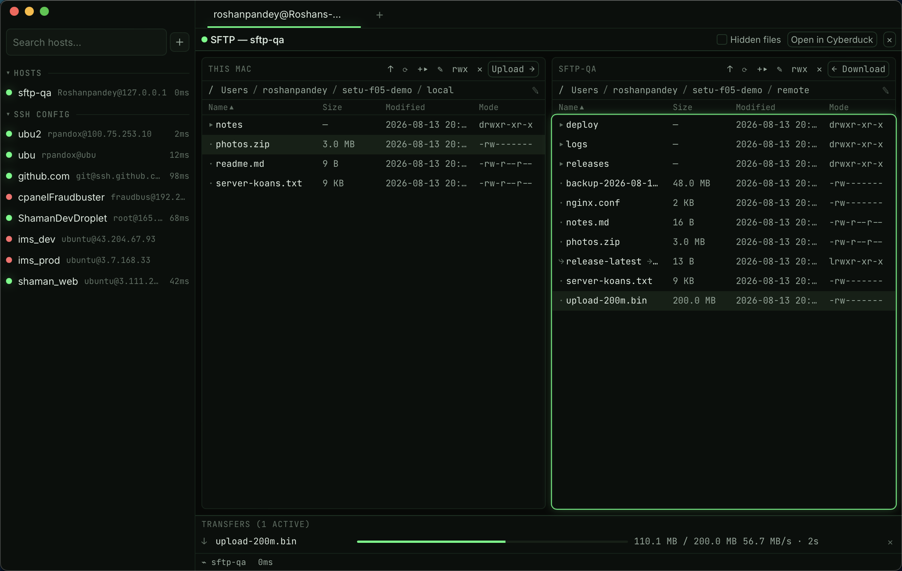

# F5 · SFTP & files

> Spec: [PLAN.md](../../PLAN.md) §9 F5 · Shipped in Phase 5 (remote edit
> follows in Phase 11)

## What is it?

A dual-pane file browser between your Mac and any host: local files on the
left, the remote home on the right, and a transfer queue along the bottom.
It overlays the terminal area for the host you're working on — the session
keeps running underneath — and it's the only place Setu speaks the SSH
protocol itself (russh + russh-sftp; interactive terminals stay on system
`ssh`). Directories with 10k+ entries stay smooth: rows are virtualized.

## How do I use it?

| Keys              | Action                                                    |
| ----------------- | --------------------------------------------------------- |
| ⇧⌘S               | Toggle the SFTP panel for the focused SSH session's host  |
| ⏎                 | Open the selected directory / follow the selected symlink |
| ⌫                 | Go up one directory                                       |
| ↑ ↓               | Move the selection                                        |
| ⌘-click / ⇧-click | Multi-select entries                                      |

Focus an SSH pane and press ⇧⌘S (also in the ⌘K palette: "Toggle SFTP
panel"). The first connection walks the auth ladder: your ssh-agent,
then the host's identity file (encrypted files unlock with their
Keychain passphrase), then the host's Keychain-stored SFTP password
(Phase 7, [F8](F08-keys-vault.md)). A secret the Keychain doesn't hold
pauses the connect with a prompt — type it, **Store & connect**, and
it's saved for next time. Connecting to a host whose key isn't in
`~/.ssh/known_hosts` shows the fingerprint dialog; **Trust this key**
appends one line to `known_hosts` (that's the only write Setu ever makes
there), Cancel stops the connection. A _changed_ key never prompts — the
connection fails with both fingerprints so you can investigate.

### Moving files

- **Drag** entries from either pane and drop them on the other — uploads
  left→right, downloads right→left. Folders walk recursively.
- **Drop from Finder** anywhere on the open panel to upload into the
  remote pane's current directory.
- **Double-click** a file to send it to the other pane; the **Upload → /
  ← Download** buttons send the selection.
- The queue runs three transfers at once and streams the rest; each row
  shows progress, speed, and ETA. **✕** cancels (the partial file is
  removed), **⟳** retries a failure. Transfers that die from a dropped
  connection retry themselves once.

### Managing files

Each pane's toolbar: **↑** up, **⟳** refresh, **+▸** new folder, **✎**
rename, **rwx** permissions (octal field + checkboxes, both panes), **✕**
delete (confirms; folders delete recursively). The path bar shows
clickable breadcrumbs — click ✎ (or the path) to type a path with Tab
completion. "Hidden files" in the panel header shows dotfiles. Symlinks
display `⤷ name → target` and are followed on double-click, never during
listing or delete.

"Open in Cyberduck" hands the current remote directory to your `sftp://`
handler (Cyberduck, if installed) — the escape hatch when you need
something this browser doesn't do.

Hiding the panel (⇧⌘S or ✕) keeps the connection and any transfers
running. Opening the panel for a _different_ host closes the previous
connection — running transfers for the old host are cancelled (you'll get
a toast).

## What can go wrong?

- **"authentication … failed"** — the panel lists what was tried. No
  agent identities? `ssh-add` your key (`ssh-add -l` to check).
  Passphrase-protected files and password-only hosts prompt for their
  secret and store it in the Keychain ([F8](F08-keys-vault.md)); a
  pubkey-only server never sees a password prompt. The host must also
  allow your user: SFTP doesn't read `~/.ssh/config`, so hosts imported
  from there need a hostname and user on the record (adopt the host and
  fill them in).
- **"HOST KEY CHANGED"** — the server's key doesn't match
  `~/.ssh/known_hosts`. If the server was legitimately reinstalled,
  remove its old line (`ssh-keygen -R <host>`) and reconnect; otherwise,
  treat it as the warning it is.
- **"Permission denied"** — shown verbatim from the server or macOS.
  There is no sudo mode in v1; use a terminal for privileged file work.
- **A transfer shows "failed"** — transient causes (connection dropped,
  timeout) retried once already; **⟳** tries again. Partial files are
  cleaned up on cancel and failure, so a retry starts clean.
- **Nothing happens on ⇧⌘S** — the shortcut needs a focused SSH pane;
  local shells have no host to browse.
