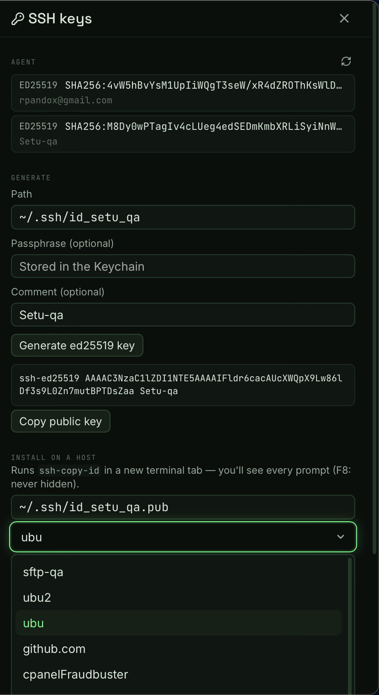

# F8 · Keys & vault

> Spec: [PLAN.md](../../PLAN.md) §9 F8 · Shipped in Phase 7

## What is it?

Agent-first identity, and secrets that never touch disk. Setu treats the
ssh-agent as your normal way in; when a password or passphrase is
unavoidable (SFTP to a password-only box, an encrypted key file), it
lives in the **macOS Keychain** — service `dev.pandox.setu` — and
nowhere else. The Keys panel wraps the whole workflow: see what the
agent holds, generate a key, push it to a host, export an encrypted
backup.

Two rules hold everywhere:

- **Interactive terminals stay agent-first.** Setu never types a
  password into a PTY for you — that's the insecure path the spec rules
  out. Keychain passwords are for **SFTP only**.
- **Secrets never flow toward the UI.** The app can store, replace,
  delete, and check for a secret, but no IPC command ever returns one;
  reads happen inside the Rust core's SFTP auth ladder alone.

## The Keys panel

Open it from the ⌘K palette ("Manage SSH keys") or the "Manage SSH
keys…" link under the host editor's Identity field.



**Agent.** What `ssh-add -l` reports: type, `SHA256:` fingerprint,
comment. Hardware-backed keys (`*-sk`) get an `hw` badge — expect a
touch prompt when you connect. No agent is a banner with the fix, never
a silent failure.

**Generate.** `ssh-keygen -t ed25519` with a filename, an optional
passphrase, and an optional comment. The passphrase is typed into
ssh-keygen's own prompts through a hidden PTY — it never appears on a
command line where `ps` could read it — and is stored in the Keychain
(`passphrase:{path}`) so SFTP can use the key immediately. Existing
files are never overwritten. The public key shows up right there with a
copy button.

**Install on a host.** The ssh-copy-id helper opens a **new terminal
tab** and runs `ssh-copy-id -i <key>.pub user@host` in it, visibly —
you see and answer the remote password prompt yourself. Nothing runs
hidden.

## SFTP passwords & passphrases

The host editor gains an **SFTP password** row: type it once, hit
Store, and it lands in the Keychain (`password:{host-uuid}`) — never in
`hosts.toml`, which stays plaintext-safe by schema. "Stored in
Keychain" plus a Clear button is all you ever see again.

On an SFTP connect, the auth ladder now runs: agent identities → the
host's identity file (encrypted files unlock with the Keychain
passphrase) → the Keychain password. A missing secret pauses the
connect with a prompt dialog — type it, **Store & connect**, done; it's
in the Keychain for next time. A pubkey-only server never triggers a
password prompt: the ladder reads the server's own list of allowed
methods first.

macOS may ask for authorization (Touch ID, depending on your Keychain
policy) when Setu reads an entry — that's the OS doing its job.

## The vault

An encrypted backup of `~/.config/setu` — hosts, snippets, settings,
themes — as one `.tar.age` file:

```sh
age -d setu-vault.tar.age | tar -x    # restore anywhere
```

Pick a passphrase in the Keys panel's Vault section and export.
**Secrets stay out by default**; a second, explicit toggle bundles the
known Keychain entries (each persisted host's SFTP password and each
configured key's passphrase) as `keychain-secrets.toml` _inside_ the
encrypted tarball. The `.git` directory never rides along.

## Keychain accounts (reference)

| Account             | Holds                   | Scope                           |
| ------------------- | ----------------------- | ------------------------------- |
| `password:{uuid}`   | a host's SFTP password  | per host                        |
| `passphrase:{path}` | a key file's passphrase | per key — shared hosts share it |

Both live under the Keychain service `dev.pandox.setu`. Passphrases key
on the tilde-expanded path, so `~/.ssh/id_ed25519` and its absolute
spelling are one entry.

## What can go wrong?

- **"No ssh-agent is running."** macOS launches one per login session;
  `ssh-add ~/.ssh/id_ed25519` in any terminal usually wakes everything
  up. In bare shells, `eval $(ssh-agent)` first.
- **"… already exists — pick another filename."** Key generation never
  overwrites. Choose a new path or move the old key first.
- **"The stored passphrase didn't unlock …"** The Keychain entry is
  stale (the key was re-encrypted?). The prompt reappears — typing the
  current passphrase replaces the entry.
- **"<host> rejected the stored password."** Password changed
  server-side. Same story: the prompt lets you store the new one.
- **The password prompt never appears for a password-only host.** The
  server must actually offer `password` auth; check
  `PasswordAuthentication yes` in its sshd config.
- **Touch ID prompts on every read.** That's your Keychain ACL policy
  for the app (unsigned dev builds re-prompt more) — approve with
  "Always Allow" to quiet it.
