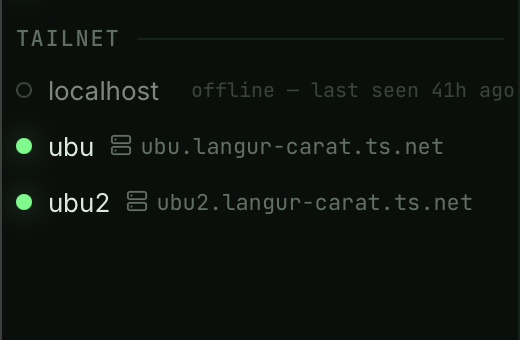

# F9 · Tailscale awareness

> Spec: [PLAN.md](../../PLAN.md) §9 F9 · Shipped in Phase 7

## What is it?

Your tailnet as a first-class host source. When the `tailscale` CLI is
installed and logged in, the sidebar grows a **Tailnet** section listing
your peers — MagicDNS name, OS, tags — with LEDs that mirror
Tailscale's _own_ online state. No TCP probes ever touch these rows:
Tailscale already knows who's online, and Setu believes it.



Peers are **ephemeral**: nothing is written to `hosts.toml` until you
adopt one. Setu re-reads `tailscale status --json` at connect time, so
the section (and every connect) always reflects the tailnet as it is
right now.

## How do I use it?

**Connect** — click a peer row (or find it in ⌘T quick-connect: peers
rank alongside your hosts). The session runs plain system `ssh` to the
peer's MagicDNS name as the **default tailnet user**:

```toml
# ~/.config/setu/settings.toml
[tailnet]
default_user = "ops"     # empty/missing → your local $USER
```

Peers with the `ts-ssh` badge run **Tailscale SSH** — the tailnet
authenticates you, so the connect is key-free.

**Adopt as host** — the folder icon copies the peer into `hosts.toml`
as a normal editable host (its MagicDNS name stays the hostname). From
then on it lives in your groups, gets probed like any host, and the
tailnet row collapses into it — marked with a small `ts` badge instead
of appearing twice.

**Ping to wake** — the radio icon runs `tailscale ping` (three tries,
2 s each) to warm the path to a dozing peer; the result lands as a
toast. Useful before connecting to something that idles behind NAT.

**Offline peers** stay listed, dimmed, with their last-seen time — the
tailnet's memory of them, not a probe result.

## Where things come from

| Fact           | Source                                                                        |
| -------------- | ----------------------------------------------------------------------------- |
| peer list      | `tailscale status --json`, polled every 30 s (paused while the app is hidden) |
| online LED     | Tailscale's `Online` field — never a TCP probe                                |
| `ts-ssh` badge | the peer advertises Tailscale SSH host keys                                   |
| login user     | `[tailnet] default_user` → fallback: your `$USER`                             |

The binary is found on `PATH`, in Homebrew's directories, or inside
`/Applications/Tailscale.app` — GUI apps get a minimal `PATH`, so Setu
looks where installers actually put it.

## What can go wrong?

- **No Tailnet section at all.** That's the graceful hide: the binary
  is missing, the daemon is stopped, or you're logged out
  (`tailscale up` fixes the last two). Nothing errors — the section
  simply doesn't exist until the tailnet does.
- **Connect asks for a password / fails auth.** The peer isn't running
  Tailscale SSH (no `ts-ssh` badge) and doesn't know your key. Use the
  F8 ssh-copy-id helper, or adopt the peer and configure identity like
  any host.
- **The wrong user.** One-click connects use the default tailnet user —
  set `[tailnet] default_user`, or adopt the peer and give it its own
  user field.
- **A peer shows offline but the machine is up.** Tailscale's own view
  lags a little; "Ping to wake" usually refreshes it within a poll.
- **Duplicate rows for one machine?** Doesn't happen by design: a peer
  whose MagicDNS name equals an existing host's hostname folds into
  that row with the `ts` badge.
