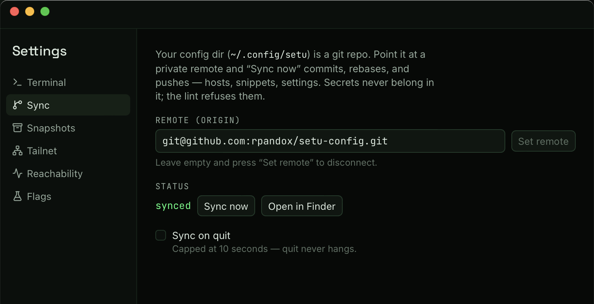

# F10 · Sync, backup & settings

Spec: [PLAN.md](../../PLAN.md) §9 F10 · shipped in Phase 8.

Your config everywhere you are, owned by you: `~/.config/setu` — hosts,
snippets, settings, themes — becomes a **git repo** that syncs to any
remote you control, with a secrets lint standing in front of every
commit, and scheduled tar.gz snapshots as the safety net under it all.
Phase 8 also ships the **Settings window** (⌘,), where sync, terminal,
tailnet, reachability, and snapshot knobs live.



## What is it?

- The config dir is plain TOML and holds **no secrets by design**
  (secrets live in the macOS Keychain — F8). That makes it safe to
  version and safe to push to a private repo.
- The **sidebar footer** shows a status dot with five states: green =
  synced, amber = something to push (or the remote has news), red =
  conflict, hollow = local-only (no remote). Click it for the full
  story and the actions.
- **Sync now** = commit (`setu: <hostname> <timestamp>`) → fetch →
  rebase → push. No remote configured? It just commits locally — still
  useful history.
- The status bar mirrors the dot as a quiet `sync ✓ / ↑ / ↓ / ✕` chip
  once a remote is configured.

## How do I use it?

### Point it at a private repo

1. Create an empty **private** repository (GitHub, or any git host).
2. ⌘, → Sync → paste the remote URL (`git@github.com:you/setu-config.git`)
   → **Set remote**. SSH URLs use your existing keys and agent — Setu
   stores no git credentials.
3. Click **Sync now** (footer, palette, or the Settings button).

The remote lives in the repo's own `.git/config`, _not_ in the synced
`settings.toml` — each machine keeps its own remote setting, so two
machines can't overwrite each other's.

### A second machine

```sh
git clone git@github.com:you/setu-config.git ~/.config/setu
```

Launch Setu — hosts, snippets, and settings are all there. From then on
both machines just use Sync now; divergent edits are rebased.

### The Settings window (⌘,)

| Section      | What's in it                                                                                                         |
| ------------ | -------------------------------------------------------------------------------------------------------------------- |
| Terminal     | `[terminal] font_size` (8–32 px) · `scrollback_lines` — **hot-applied** to every open terminal on save               |
| Sync         | remote URL · status + Sync now · `[sync] auto_sync_on_quit` (capped at 10 s)                                         |
| Snapshots    | `[snapshots] enabled` · `interval_days` (default 7) · `keep` (default 10) · Snapshot now                             |
| Tailnet      | `[tailnet] default_user` (F9)                                                                                        |
| Reachability | `[reachability] enabled` · `interval_s` · `timeout_ms` · `max_concurrent` (F1) — re-tunes the running prober on save |
| Flags        | the advanced track's switches, disabled until their phases ship                                                      |

Everything writes `~/.config/setu/settings.toml` atomically — the file
stays hand-editable, and hand edits show up the next time the window
opens.

### The secrets lint

Every sync lints the working tree **before anything is staged**. A hit
refuses the whole sync and shows the offending lines (footer popover),
file and line number included:

- assignments to secret-looking keys — `password`, `passwd`, `token`,
  `secret`, `api_key`, `private_key` — with a non-trivial value
  (booleans and plain numbers pass: `use_password_auth = true` is
  configuration, not a credential);
- PEM private-key headers (`-----BEGIN … PRIVATE KEY-----`);
- base64 runs of 40+ characters — with ssh **public** keys allow-listed
  (`ssh-ed25519 …` lines are fine and expected).

The fix is never "bypass the lint": move the secret to the Keychain
(host editor → SFTP password; key passphrases are stored when you unlock
them) and delete the line.

### Snapshots

A `setu-config-<timestamp>.tar.gz` of the whole config dir lands in
`~/Library/Application Support/dev.pandox.setu/snapshots/` on a schedule
(weekly by default, newest 10 kept — both knobs in Settings), plus
whenever you click **Snapshot now**. Restore is one command:

```sh
tar -xzf setu-config-20260814-093104.tar.gz
# → ./setu-config/ — copy what you need back into ~/.config/setu
```

Snapshots never include `.git` and never leave your machine. For an
encrypted, portable backup — including optional Keychain secrets — use
the vault export instead ([F8](F08-keys-vault.md)).

## What can go wrong?

- **The dot turns red (conflict).** Two machines edited the same lines
  and the rebase stopped — nothing is auto-resolved, ever. The popover
  lists the conflicted files and offers **Open in Finder**: fix the
  `<<<<<<<`/`>>>>>>>` markers in any editor, then Sync now again.
  Don't want to deal with it? **Cancel sync** (`git rebase --abort`)
  puts everything back exactly as before the sync; the remote's version
  will still be there next time.
- **"fetch failed" / "push failed".** Network down, or the remote
  refused your key. Every git call runs prompt-free with a 30 s cap, so
  a dead VPN can't hang the app — the footer shows git's own words.
  Check `ssh -T git@github.com` works in a terminal.
- **Sync on quit didn't push.** It's capped at 10 seconds and skips
  while a conflict is pending — quit is never held hostage. The next
  Sync now catches up.
- **The lint flagged something legitimate.** The popover shows the
  exact line and rule. If it's genuinely not a secret, rename the key
  (the assignment rule matches on key names) or move the value out of
  the config dir. The heuristics are deliberately strict — this repo
  gets pushed.
- **`behind` looks stale.** The dot's behind-count reflects the last
  fetch (status checks never touch the network). Sync now fetches and
  settles it.

Config files: `~/.config/setu/settings.toml` (all keys above, schema in
[PLAN.md](../../PLAN.md) §4) · the config repo itself in
`~/.config/setu/.git`. IPC surface: [ipc.md](../dev/ipc.md) —
`settings_*`, `git_sync_*`, `snapshot_now`, `sync_open_dir`.
