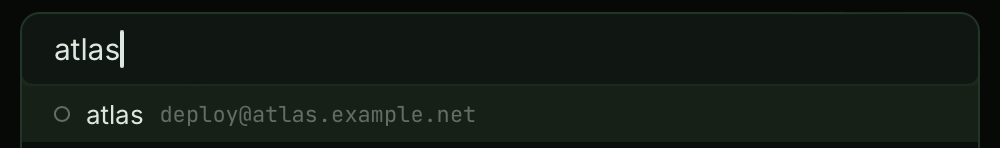

# F11 · Command palette & quick connect

The whole app behind two keystrokes. Phase 2 shipped the quick-connect
half; Phase 4 completes the palette: ⌘K lists every implemented command
next to your hosts, results carry their live LEDs, and ranking learns
which machines you actually use.

## What is it?

One palette, two doors. **⌘K** opens the full command palette: an
**Actions** section listing every keyboard-map command with its shortcut
(so the palette doubles as the app's cheat sheet), and a **Hosts** section
below it. **⌘T** is the same palette pre-filtered to hosts — type a few
characters, ⏎, shell prompt.

Hosts rank by fuzzy match blended with **frecency** — how often and how
recently you've connected — so with an empty query, ⌘T's list is your
most-used machines, and near-tie matches go to the host you actually use.
Frecency lives in this machine's `state.json`
([store.md](../dev/store.md)); it never syncs.

## How do I use it?

| Keys  | Action                                     |
| ----- | ------------------------------------------ |
| ⌘K    | Open the command palette (actions + hosts) |
| ⌘T    | Open quick connect (hosts only)            |
| ↑ / ↓ | Move the selection                         |
| ⏎     | Run the action / connect to the host       |
| ⌘⏎    | Connect in a new tab (even if one is open) |
| ⌘E    | Edit the selected host                     |
| ⌘C    | Copy the selected host's ssh command       |
| Esc   | Dismiss                                    |

- **⏎ on a host reuses a live tab** when one is already connected there;
  ⌘⏎ always opens a fresh tab.
- **Actions run immediately** — split, broadcast, tab jumps, everything
  the keyboard map does — and each shows its shortcut, so the palette
  teaches the fast path.
- Typo-tolerant: `hemres` still finds `hermes`.
- LEDs in results are live: green = reachable now, red = unreachable,
  pulse = session open ([F01](F01-hosts.md) has the full table).
- ⌘E is disabled on imported `~/.ssh/config` rows (they're read-only
  until adopted).

## What can go wrong?

- **No matching hosts.** The palette searches known hosts only — ad-hoc
  `user@host` connections arrive with Phase 11. Add the host first
  (sidebar `+`), or give it an alias in `~/.ssh/config`.
- **The wrong host ranks first.** Connect to the right one once or twice
  — frecency folds recent use into the ranking. If two hosts genuinely
  share a name, rename one; label matches always outrank the rest.
- **An action you expect is missing.** The palette lists commands whose
  features exist. SFTP, prompt jumps, the quake terminal, and settings
  join it in their phases (PLAN.md §8 has the full future map).
- **⌘C copied the host command instead of my selected text.** ⌘C only
  copies the ssh command when nothing is selected in the search field;
  select text first to copy it normally.
